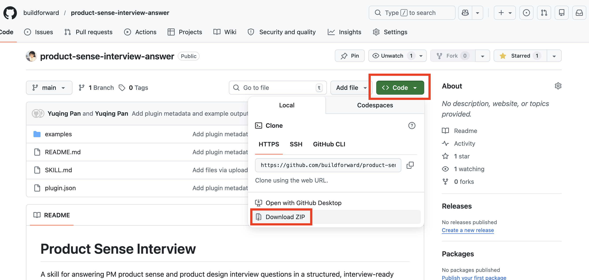
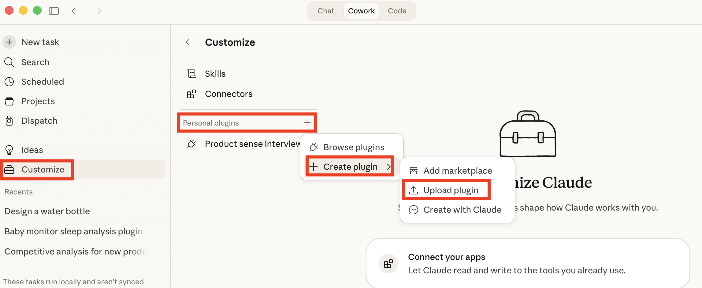
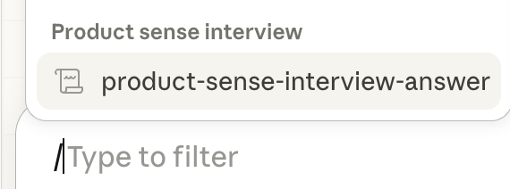

# Product Sense Interview

A skill for answering PM product sense and product design interview questions in a structured, interview-ready format. Summarized after spending I spent way too much paying for expensive PM mock interviews and wasting time practicing hundreds of mock questions.

It turns open-ended prompts like "Design a product for X" or "How would you improve X?" into a complete spoken-response script with a consistent 6-section flow, fixed transitions, prioritization logic, and clear MVP framing.

---

## What Is a Skill?

A skill is a structured markdown file (`SKILL.md`) that teaches an AI agent how to do a specific task — the right way, every time, without you explaining your process from scratch.

Instead of saying *"Answer this PM interview question"* and hoping for the best, the agent already knows:
- How to structure the 6-section answer
- Which prioritization frameworks to apply and when
- What fixed transitions to use under interview pressure
- What good looks like — and what to avoid

**Skills = Less explaining. More strategic practice.**

---

## What This Skill Does

For a given product design question, the skill generates a complete spoken-answer script in 6 sections. Each section follows strong PM interview structure with prioritization logic built in.

| Section | Time | What It Covers |
|---|---|---|
| 1. Clarification | ~2 min | Scope the problem with 2 key assumptions |
| 2. Strategic Rationale | ~5 min | Market, company fit, competitive gap, thesis |
| 3. Product Goal | ~2 min | North star outcome — not a feature description |
| 4. Market Segmentation | ~5 min | Ecosystem players → dimensions → persona |
| 5. Pain Points | ~10 min | Journey-mapped pains, ranked by frequency × severity |
| 6. Solutions | ~15 min | 3 MECE solutions → impact/effort evaluation → MVP |

---

## Example Prompts

- "How would you improve YouTube?"
- "Design a fire alarm for the deaf"
- "What would you build next for DoorDash?"
- "Build a feature for Instagram creators"
- "How would you grow Duolingo?"

See the `examples/` folder for full output scripts.

---

## What Makes It Different

- **Strong PM structure:** balances user insight with business and strategic reasoning
- **Prioritization built in:** forces explicit tradeoffs on reach, impact, fit, frequency, severity, and effort
- **MECE lists:** reduces overlap across segments, pain points, and solutions
- **Spoken-answer oriented:** optimized for saying the answer out loud, not reading it
- **Fixed transitions:** creates cleaner delivery under interview pressure
- **Word budgets:** hard ceilings per section prevent rambling

---

## How to Use This Skill

### Claude.ai Chat (recommended for non-developers)

1. In Github, download `SKILL.md` from this repo
2. Start a new Claude conversation and attach the file
3. Ask your question: *"Design a product for travelers with flight anxiety"*

### Claude Cowork (recommended for non-developers)

1. In Github, Download this whole repo as "zip" by clicking the green "code" button

   

2. Go to Claude Cowork and open "Customize" (bottom-left)
3. Click "+" next to "Personal plugins"
4. Click "+ Create plugin"
5. Click "Upload plugin" and drop the zip file

   

6. Create a new task, use command "/" to pull up the skill

   

### ChatGPT / Codex (recommended for non-developers)

1. Go to **My GPTs → Create a GPT**
2. Upload `SKILL.md` under **Knowledge**
3. In GPT instructions, add: *"Apply the Product Sense Interview skill to every product design question."*
4. Or paste into a **ChatGPT Project** for team-wide access

### Claude Code (CLI)

```bash
# Point at the skill file directly
claude --context SKILL.md "How would you improve Spotify for college students?"

# Or add to CLAUDE.md for persistent loading
echo "- product-sense-interview/SKILL.md" >> CLAUDE.md
```

### Cursor / Windsurf

```
# Reference on demand
@SKILL.md
How would you improve YouTube?

# Or add to .cursorrules / .windsurfrules for persistent loading
```

### Other Platforms (n8n, LangFlow, Make.com, Replit, Bolt, Lovable, etc.)

The skill is a single markdown file. Any platform that accepts a system prompt or knowledge file can use it:
1. Paste `SKILL.md` content into the system prompt or knowledge field
2. Pass the interview question as user input
3. The agent applies the 6-section framework automatically

---

## License

MIT
